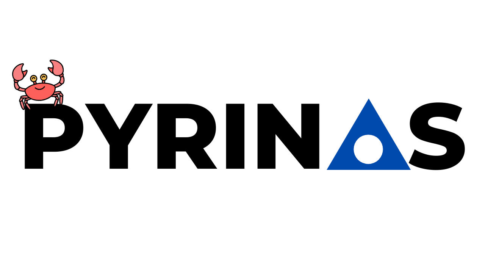

# Pyrinas Server & CLI



For the latest changes, check out the [changelog](Changelog.md). 

Interested how all the pieces fit together? Check out the [architecture](Architecture.md);

## What is Pyrinas Server?

Pyrinas, means core or nucleus in Greek (pronounced pir-inas). It's meant to be used as the core server application that conects the [nRF9160 Feather](https://www.jaredwolff.com/store/nrf9160-feather/) and boards like it to the cloud via MQTT. 

It currently includes the abillity to:

1. Save, publish and facilitate OTA updates via a self-serve HTTP endpoint
2. Publish sensor data on to a separate InfluxDB instance (Optional)
3. Act as a secure MQTT broker (thanks to [rumqttd](https://github.com/bytebeamio/rumqtt)) utilitzing Rusts's `native_tls` 
4. Provides an admin interface using WebSockets for configuring the server, uploading OTA updates, etc. (Optional but recommended)
5. Tested and works well with reverse proxies like Caddy

Pyrinas is also meant to integrate with the Zephyr module implementation for easy publishing of device data. For more information check out [that repository.](https://github.com/pyrinas-iot/pyrinas-zephyr)

While you can run the example server on it's own, this library ultimately allows you to integrate your own project logic, web servers, frontends and backends. The possiblities are endless!

### What this project is

* Scafolding and pre-tested components for deploying nRF9160 + Zephyr devices with relative ease.
* Meant for small-medium deployments

### What this not

* A one-size fit all implementation for all IoT Devices
* Pre-configurable server with all the features and protocols (not yet at least!)

## Building

You'll want to clone this repository onto your server or onto a build server with the same architecture/OS.

```
git clone https://github.com/pyrinas-iot/pyrinas-server-rs.git
```

The server is not yet in a Crate due to some un-published dependencies. Hopfully those will get taken care of in the future..

You'll need the latest version of `rust`. You can use [`rustup`](https://rustup.rs) to download and install.

```
> cargo build --package pyrinas-server --release
> cargo build --package pyrinas-cli --release
```

The server can be cross compiled using other platforms. Pyrinas is mostly used on and is compiled fairly regularly on FreeBSD. It does have some dependencies on OpenSSL/Libc so you'll need to configure these for your intended system of use.

This will build the example server and cli. They'll be available in the `target/release/` folder. 

## Running the example server & CLI

While this is more of a library than an executable, you can compile and run the included examples to get an idea of how things work. For more info check out [Using the Example](docs/using-the-example.md) for a step-by-step guide.


### Using `cross`

You can use [`cross`](https://github.com/rust-embedded/cross) to build cross-compiled versions of Pyrinas.

Once you have it installed simply invoke `cross` as if you would `cargo`

```
> cross build --package pyrinas-cli --target x86_64-unknown-freebsd
```

While `cross` is a handy tool, it takes almost 3 times as long to build a FreeBSD target using `cross`'s Docker based container than simply building it in a FreeBSD VM. (2015 MBP - 16GB Ram)

**Note:** the default target is `x86_64-unknown-freebsd` and is configured in `Cross.toml`.

**Another note** if you do know how to speed Docker based builds up i'm all eyes & ears!

## Configuring the Server

Pyrinas uses TOML for it's configuration. There is an example TOML file included in this repository. (`config.example.toml`)

For more details on running the included example.

## Configuring the CLI

The first time you run the CLI you should cofigure your admin address and API key.

The **address** is where you can safely access your admin endpoint. Highly recommended to have this behind a TLS reverse proxy. Alternatively, don't expose the endpoint at all and access safely behind a VPN like `wireguard`.

The **api key** is set within the server's **confg.toml**. It's recommended to make it long and not easily guessable/bruteforceable. 

```
> pyrinas-cli config install admin.yourdomain.com <YOUR API KEY>
```

This will place a CLI configuration in your $HOME/.pyrinas/ folder. You can always re-run the command to overwrite the previous configuration if something changes. 


## What's on deck?

Here's what's on my plate and what's to come:

- [x] Serving OTA updates from CLI all the way to a test device
- [ ] Provide clear documentation for current exmaples 
  - [ ] For server side
    - [ ] Example of full workng setup (and the steps to complete it)
  - [ ] CLI 
  - [ ] Zephyr side as well
- [x] Uploading an OTA package directly from Zephyr based repository
 - [x] Clean build checks
- [ ] Removing update remotely
- [ ] Implement more tests around:
 - [ ] Broker and optional broker capabilties 
 - [ ] Better coverage in OTA
 - [ ] Better coverage in Mqtt
 - [ ] Better coverage in Admin area
- [ ] More functionality/control for Admin

## Don't see what you're looking for?

Consider creating a feature request and supporting this project by [purchasing hardware](https://www.jaredwolff.com/store/nrf9160-feather/).

## License

This repository has an Apache 2.0 license. Contributions will be licensed the same with no additional terms or conditions. See `LICENSE` file for more information.

## Attribution

Crab icon made by [Flat Icons](https://www.flaticon.com/authors/flat-icons)